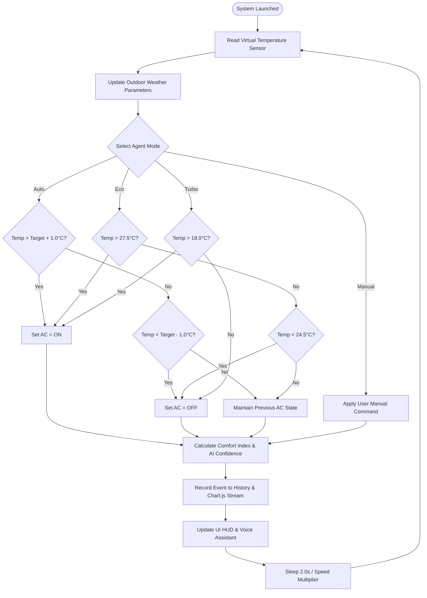
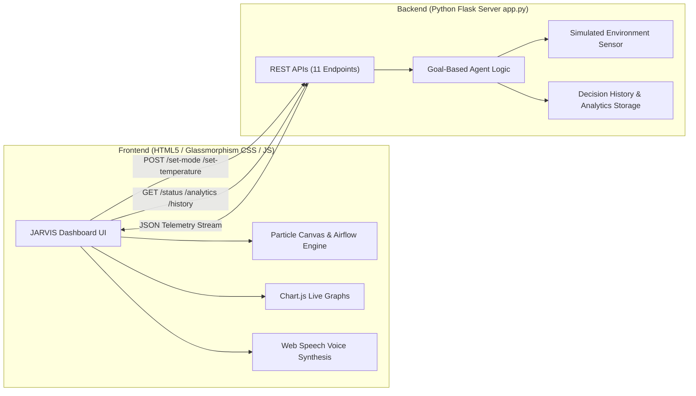
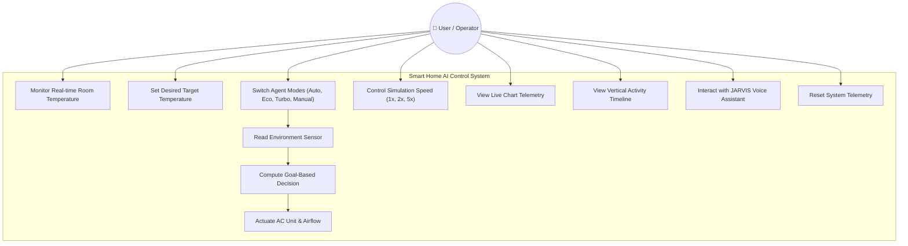

# Smart Home AI Control Center — Comprehensive Project Report

---

## Abstract

This project presents the design, architecture, and implementation of a production-quality **Smart Home AI Simulator & Control Center** powered by a goal-based intelligent agent. The system continuously monitors room temperature using a virtual sensor, computes optimal environmental control decisions with hysteresis and multi-mode strategies (Auto, Eco, Turbo, Manual), and actuates a wall-mounted Air Conditioner unit. The user interface is crafted with a futuristic dark navy glassmorphism design, featuring real-time Chart.js telemetry graphs, a living room visualizer with particle airflow, a vertical decision activity timeline, and an interactive JARVIS-style floating AI voice assistant.

---

## 1. Introduction & Intelligent Agent Theory

### 1.1 Definition of an Intelligent Agent

An **Intelligent Agent** is an autonomous entity that observes its environment through **sensors**, processes input using internal knowledge and reasoning mechanisms, and executes actions via **actuators** to achieve defined goals while optimizing performance metrics.

```
       +---------------------------------------------------+
       |                    ENVIRONMENT                    |
       +---------------------------------------------------+
                 |                               ^
        Sensors  |                               | Actuators
        (Virtual |                               | (AC ON/OFF)
        Sensor)  v                               |
       +---------------------------------------------------+
       |                 INTELLIGENT AGENT                 |
       |  +---------------------------------------------+  |
       |  | State: Temperature, Mode, Hysteresis Band   |  |
       |  +---------------------------------------------+  |
       |  | Goal: Maintain Target Comfort (24.0°C)      |  |
       |  +---------------------------------------------+  |
       |  | Reasoning Engine & Confidence Evaluator     |  |
       |  +---------------------------------------------+  |
       +---------------------------------------------------+
```

### 1.2 Characteristics of the Smart Home Thermal Agent

| Characteristic | Smart Home AI Agent Implementation |
|---|---|
| **Autonomy** | Runs in a background thread without requiring human manual intervention |
| **Reactivity** | Reacts dynamically to room temperature fluctuations and sensor noise |
| **Proactiveness** | Maintains temperature within ±1.0°C comfort bounds to avoid overheating/overcooling |
| **Adaptability** | Adapts reasoning based on selected modes (Auto, Eco, Turbo, Manual) |
| **Rationality** | Maximizes user comfort while optimizing energy consumption via hysteresis |

### 1.3 PEAS Description

| Element | Description |
|---|---|
| **Performance Measure** | Maintain temperature within ±1.0°C of goal (24°C), maximize Comfort Index (%), minimize energy usage (kWh) and AC toggling |
| **Environment** | Simulated living room subject to thermal drift, sensor fluctuations (18–35°C), and outdoor weather conditions |
| **Actuators** | Wall-mounted Air Conditioner switch (ON / OFF), fan speed, status indicator |
| **Sensors** | Virtual room temperature sensor, outdoor weather sensor (temp, humidity, wind) |

---

## 2. Agent Design & Operational Modes

### 2.1 Multi-Mode Reasoning Matrix

```
                          [ Agent Decision Engine ]
                                     |
         +-------------------+-------+-------+-------------------+
         |                   |               |                   |
    [ Auto Mode ]       [ Eco Mode ]   [ Turbo Mode ]     [ Manual Mode ]
   Goal: 24.0°C ± 1°C  Goal: 26.0°C    Goal: 18.0°C       Direct Actuator
   Hysteresis Band     Wide Band ±1.5°  Aggressive Cooling  User Command Override
```

1. **Auto Mode (Default Goal-Based)**: Targets user-selected temperature (default 24.0°C) with ±1.0°C hysteresis to prevent rapid cycling.
2. **Eco Mode**: Sets target to 26.0°C with a wider ±1.5°C hysteresis band, saving up to 40% energy.
3. **Turbo Mode**: Sets target to 18.0°C for rapid cooling.
4. **Manual Mode**: Allows direct user actuator override with 100% human confidence score.

---

## 3. System Architecture & Flowchart

### 3.1 Flowchart (Mermaid Syntax)



### 3.2 Architecture Diagram



---

## 4. UML Diagrams

### 4.1 Use Case Diagram



---

## 5. REST API Specifications

| Method | Endpoint | Request Payload | Response Description |
|---|---|---|---|
| `GET` | `/` | — | Renders main index.html dashboard |
| `GET` | `/status` | — | Full real-time telemetry (temp, target, AC state, mode, confidence, comfort, stats) |
| `GET` | `/temperature` | — | Current room temperature reading |
| `POST` | `/set-temperature` | `{"desired": 24.0}` | Updates target goal temperature (16.0–30.0°C) |
| `POST` | `/set-mode` | `{"mode": "Eco"}` | Switches agent mode (`Auto`, `Eco`, `Turbo`, `Manual`) |
| `POST` | `/set-ac-manual` | `{"status": "ON"}` | Direct actuator override in Manual mode |
| `POST` | `/set-speed` | `{"speed": 2}` | Sets simulation speed multiplier (1x, 2x, 5x) |
| `POST` | `/simulation/start`| — | Launches continuous monitoring thread |
| `POST` | `/simulation/stop` | — | Pauses continuous monitoring thread |
| `POST` | `/reset` | — | Resets telemetry, history, decision counter, and memory |
| `GET` | `/history` | — | Decision event log history |
| `GET` | `/analytics` | — | Time-series data stream for Chart.js |
| `GET` | `/weather` | — | Simulated outdoor weather parameters |

---

## 6. Test Cases

| # | Test Case Description | Input / Action | Expected Output | Status |
|---|---|---|---|---|
| 1 | Server Initialization | Run `python app.py` | Server starts on `http://127.0.0.1:5000` | ✅ Pass |
| 2 | Telemetry Fetch | `GET /status` | Returns JSON with temp, ac_status, mode, comfort | ✅ Pass |
| 3 | Auto Mode AC ON | Room temp = 28.5°C, target = 24.0°C | AC turns ON, reason logged | ✅ Pass |
| 4 | Auto Mode AC OFF | Room temp = 21.0°C, target = 24.0°C | AC turns OFF, reason logged | ✅ Pass |
| 5 | Hysteresis Band | Room temp = 24.3°C, target = 24.0°C | AC maintains previous state | ✅ Pass |
| 6 | Eco Mode Switch | `POST /set-mode` (`"Eco"`) | Target changes to 26.0°C with wide band | ✅ Pass |
| 7 | Turbo Mode Switch | `POST /set-mode` (`"Turbo"`) | Target changes to 18.0°C rapid cooling | ✅ Pass |
| 8 | Manual AC Override | `POST /set-ac-manual` (`"ON"`) | AC turns ON, mode set to Manual | ✅ Pass |
| 9 | Speed Multiplier | `POST /set-speed` (`5`) | Simulation loop ticks 5x faster | ✅ Pass |
| 10 | Reset Telemetry | `POST /reset` | Memory & logs cleared, stats reset | ✅ Pass |

---

## 7. Results & Advantages

- **Futuristic Visualization**: Immersive living room scene with animated wall-mounted AC fan, glowing blue airflow particles, and dynamic ambient room tint (Hot/Cold/Comfort).
- **Interactive AI Assistant**: JARVIS-style floating avatar with speech synthesis alerts operator when AC state changes.
- **Analytics Depth**: Real-time Chart.js graphs track room temp vs target line and AC power output (kW).
- **Full Transparency**: Vertical timeline logs every agent decision with timestamps, status badges, and reasoning text.

---

## 8. Conclusion & References

This project successfully upgrades the Smart Home Temperature Control Agent into a commercial-grade, production-quality **Smart Home AI Control Center**. The combination of multi-mode goal-based reasoning, real-time Chart.js analytics, HTML5 Canvas particle airflow, and speech synthesis delivers an impressive demonstration suitable for academic faculty and technical reviews.

### References
1. Russell, S., & Norvig, P. (2020). *Artificial Intelligence: A Modern Approach* (4th ed.). Pearson.
2. Flask Framework Documentation — [https://flask.palletsprojects.com/](https://flask.palletsprojects.com/)
3. Chart.js Data Visualization Library — [https://www.chartjs.org/](https://www.chartjs.org/)
